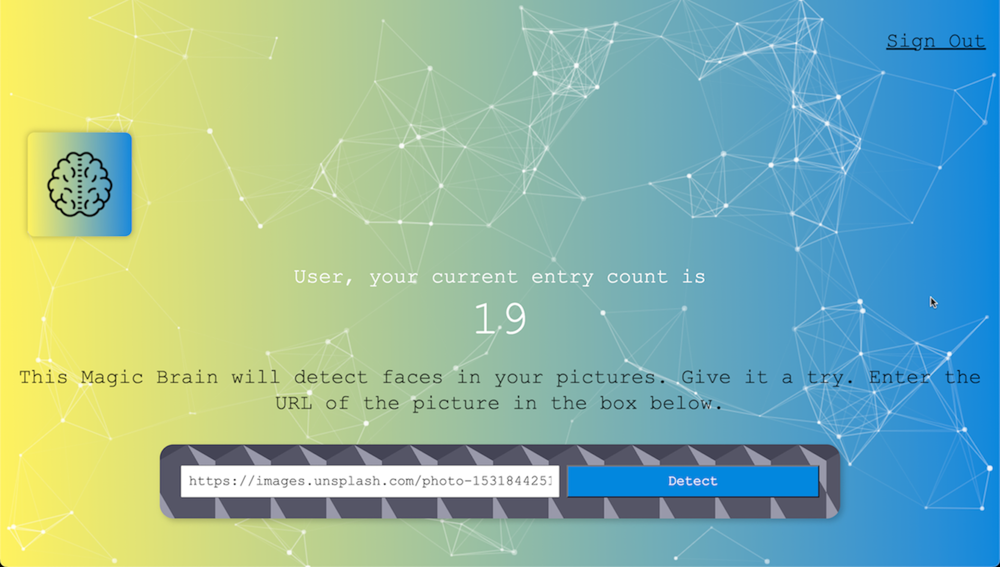
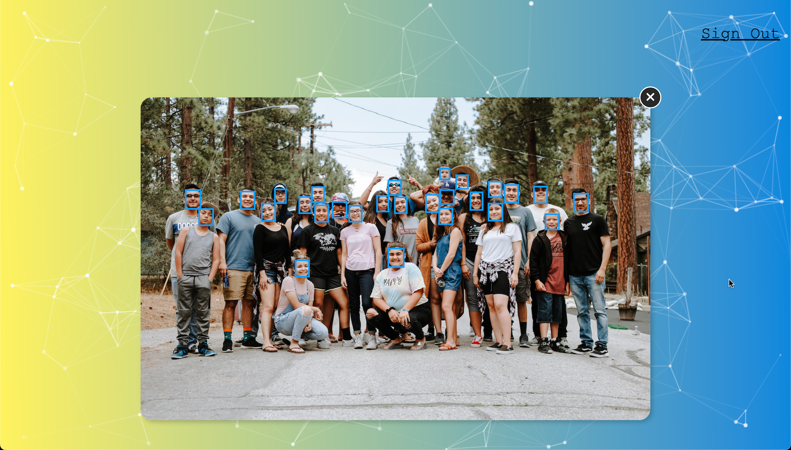

# SmartBrain

∙ Fully responsive full-stack face recognition web application with log in functionality built using React that features CRUD operations.
 
∙ It utilises the Clarifai API specifically the face detection AI model, that detects the location of human faces in images uploaded via URL by the user.
 
∙ Created an Express backend server, and built a RESTful API with Node.js.
 
∙ A PostgreSQL database was setup to store user details and entry count.
 
 

  
  &nbsp;&nbsp;&nbsp;&nbsp;
  

